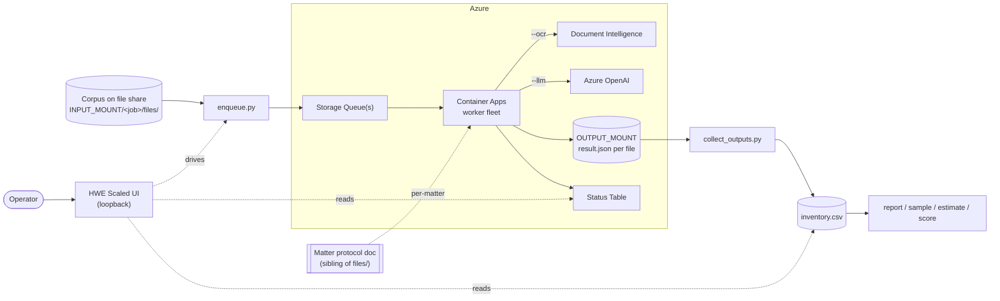
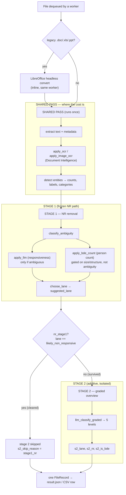
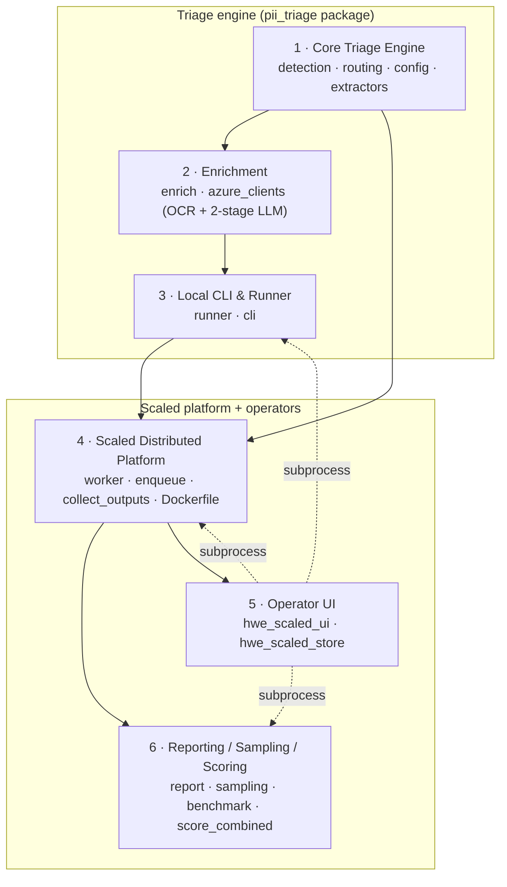
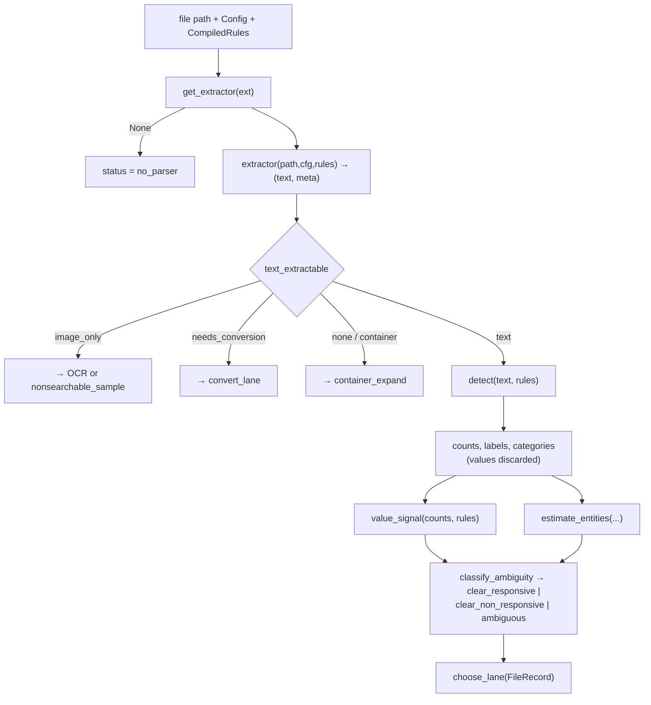
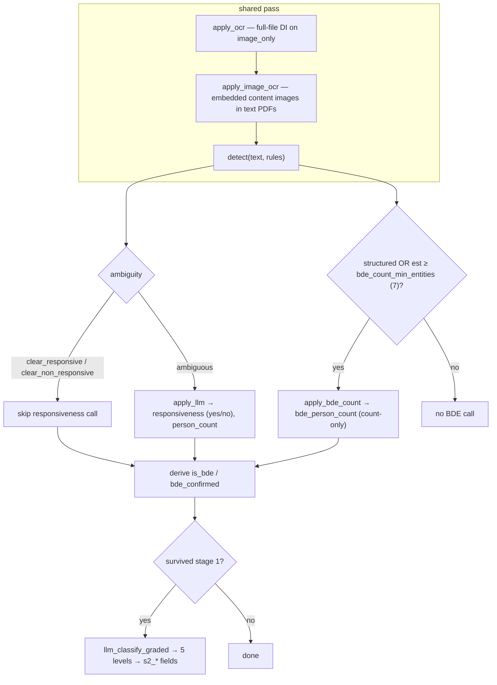
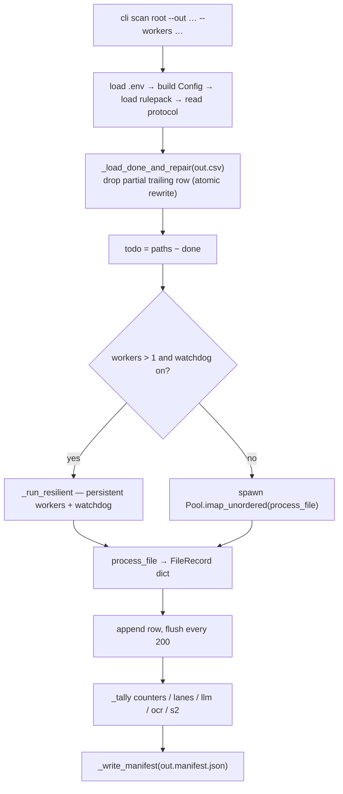
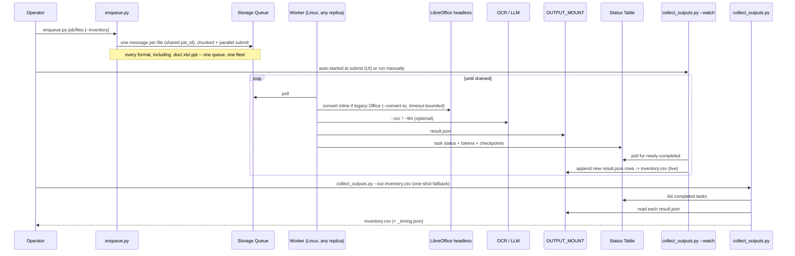
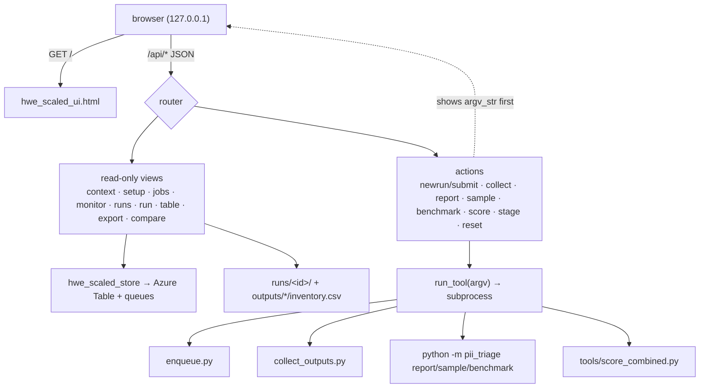
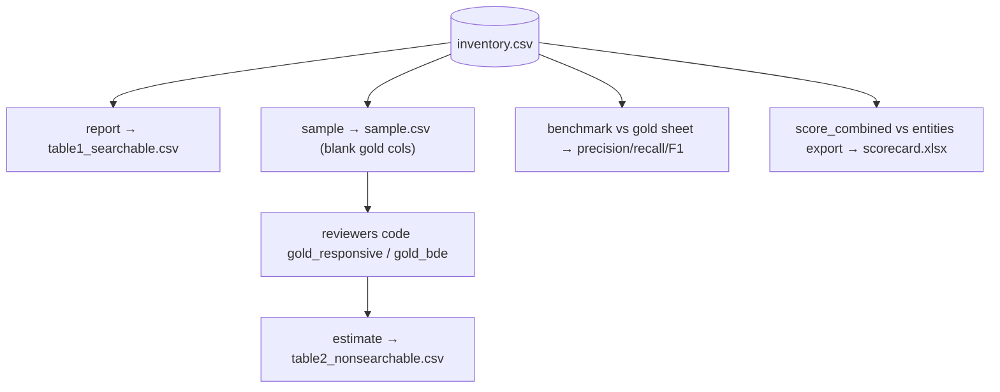

# HWE Scaled — Architecture Overview

Architecture reference for the `pii_triage` 3.0.0 HWE Bucketing & Tagging system: a read-only,
crash-safe PII triage pipeline that scans a corpus, decides responsiveness in two stages, and
produces the HWE deliverables — never storing a single PII value.

This document has three layers:

1. **System context & end-to-end workflow** — how the whole thing fits together.
2. **Six initiatives**, each with a **Workflow Diagram**, a **High-Level Design (HLD)**, and a
   **Low-Level Design (LLD)**.
3. **Appendices** — the shared data structures every initiative touches.

> Diagrams are [Mermaid](https://mermaid.js.org/) and render inline on GitHub. Companion docs:
> [`README.md`](README.md) (deployment), [`RUNBOOK.md`](RUNBOOK.md) (operations),
> [`pii_triage_merged/README.md`](pii_triage_merged/README.md) (the library),
> [`CLAUDE.md`](CLAUDE.md) (repo map).

---

## 1. System context

**The core guarantee:** entity **values** are counted and discarded in local sets; only entity
*type* labels (`Name | SSN | Address`), category tags, counts, and routing labels ever leave a
function. This holds from `detection.py` through `result.json`, `inventory.csv`, and the UI.

---

## 2. End-to-end workflow

The expensive work — extract, OCR, detect — happens **once per file** in a shared pass, then two
decision stages read the same extracted text. Stage 1 owns non-responsive (NR) removal; stage 2
only describes what survived.

**Why stage 1 owns the gate.** The two stages get *different uncertainty policies*: stage 1's
prompt rounds genuine uncertainty **up** to responsive; stage 2 expresses it as `borderline`,
which routing treats as non-responsive. So stage 2 clears on uncertainty exactly where stage 1
flags — making stage 1 the safe gate and stage 2 the informative summary, never the reverse.
Stage 2 is structurally incapable of changing a stage-1 answer (it may only write `s2_*` columns).

---

## 3. The six initiatives

| # | Initiative | Modules | Responsibility |
|---|---|---|---|
| 1 | Core Triage Engine | `detection.py`, `routing.py`, `config.py`, `extractors.py` | Extract text, count entity *types*, classify ambiguity, assign a lane |
| 2 | Enrichment | `enrich.py`, `azure_clients.py` | OCR image-only files; the two-stage LLM (responsiveness, BDE count, graded overview) |
| 3 | Local CLI & Runner | `runner.py`, `cli.py` | Single-machine orchestration: shared pass, parallelism, crash-safe resume, manifest |
| 4 | Scaled Platform | `worker.py`, `enqueue.py`, `collect_outputs.py`, `hwe_scaled_store.py`, `Dockerfile` | Distributed queue-based fleet on Azure Container Apps |
| 5 | Operator UI | `hwe_scaled_ui.py`, `hwe_scaled_ui.html`, `hwe_scaled_store.py` | Loopback web UI to drive runs and read results (no PII, read-only) |
| 6 | Reporting/Sampling/Scoring | `report.py`, `sampling.py`, `benchmark.py`, `tools/score_combined.py` | HWE Table 1 & Table 2, accuracy scoring, cost |

**Cross-cutting guarantees** (verified by tests, upheld by every initiative): read-only on the
corpus; no PII values in any output; crash-safe/idempotent; bounded work (timeouts, size/scan
caps, zip-bomb guard); graceful degrade; deterministic offline rules (network only under
`--ocr`/`--llm`); **stage isolation**; and the **frozen NR path** (stage-1 decision surfaces
pinned by hash via `tools/check_nr_frozen.py`).

---

## 4. Initiative 1 — Core Triage Engine

Modules: `detection.py`, `routing.py`, `config.py`, `extractors.py`. The deterministic, offline
heart of the system — no network, no file writes.

### 4.1 Workflow

### 4.2 HLD

- **`extractors.py`** — a dispatch table `EXTRACTORS: dict[ext → fn]`; every extractor has the
  signature `x_*(path, cfg, rules) -> (text, meta)`. It classifies each file into a
  `text_extractable` state that downstream routing keys on: `"text"`, `"image_only"`,
  `"needs_conversion"`, `"none"` (container), `"pdf_unreadable"`, `"unknown"`. Native parsers use
  only the stdlib; richer formats use optional libs and **degrade gracefully** — a missing lib
  yields `no_parser`, never a silent skip. Structured formats (`csv`/`xlsx`/`xls`) additionally
  emit `is_structured`, `structured_entity_rows`, and `structured_total_rows`.
- **`detection.py`** — compiles the Master List into `CompiledRules` and counts entity
  occurrences by type. Eight dispatch methods (`regex`, `keyword`, `name`, `address`, `money`,
  `ssn`, `labeled_value`, plus a no-op else). Matched values live only in local `set`s and are
  discarded on return; `detect()` returns `(counts, labels, categories)` — never values.
- **`routing.py`** — defines the `FileRecord` schema (the CSV contract), the ambiguity
  classifier, entity/complexity bucketing, and the `choose_lane` decision tree (11 lanes). Pure
  stdlib, no I/O — deterministic and testable.
- **`config.py`** — loads the Master List (`load_rulepack`) with default-inheritance, defines the
  11 PI-Type categories, and the `Config` dataclass that every knob flows through.
  `Config.to_manifest()` redacts `protocol_text` and reduces the rulepack to key names.

**Key design decisions.** Detection is *data-driven* by entity **definitions** (never values).
Name detection is **structural** (title / field-label / salutation) — there is deliberately no
first-name list, because that both misses real names and false-matches companies/places; bare
capitalized pairs are left to the LLM. `value_signal` encodes the protocol rule that *a bare name
alone is not responsive*.

### 4.3 LLD

**`CompiledRules` / `EntityDef` (`detection.py`)**
- `EntityDef` fields: `key`, `label`, `category`, `method`, `regexes: tuple[re.Pattern]`,
  `per_person: bool`, `luhn: bool`, `casefold: bool`, `label_rx`, `value_rx`, `window=35`,
  `min_digits=0`, `weak: bool` (topic mention vs actual value — defaults `True` for `keyword`).
- `CompiledRules.from_pack(pack, use_ner=False)` compiles patterns (`re.I` for keyword methods).
  Properties: `per_person_keys`, `value_keys` (keys where `not weak` — the value-bearing ones).

**`detect(text, rules) -> (counts, labels, categories)`** — dispatches per `EntityDef.method`:

| method | logic | entities (default pack) |
|---|---|---|
| `regex` | `findall`; Luhn+IIN validation for cards; distinct via local set | EMAIL, PHONE, CARD |
| `keyword` | boolean presence (`n = 1` or `0`) | HEALTH, BIOMETRIC, CREDENTIALS, … |
| `name` | `len(detect_names(text, use_ner))` — structural regex or spaCy PERSON ents | NAME |
| `address` | `detect_addresses(text)` | ADDRESS |
| `money` | `detect_money(text)` | MONEY |
| `ssn` | `detect_ssn(text)` — dashed/labeled always; bare 9-digit only near an SSN label; `_ssn_plausible` rejects area `000/666/900+`, group `00`, serial `0000` | SSN |
| `labeled_value` | `detect_labeled_value(text, label_rx, value_rx, window, min_digits)` — value within `window` chars of a label | PASSPORT, DRIVER_LICENSE, TIN, DOB, BANK_ACCOUNT |

- **Card validation:** `card_valid = luhn_valid AND _card_iin_ok` — Luhn (`13≤len≤19`, mod-10) plus
  issuer-prefix/length checks, which removes Luhn-passing invoice/order IDs.
- **`value_signal(counts, rules)`** — the recall-safe floor when the LLM is off: `True` if any
  `value_keys` count > 0; else NAME + any other signal → `True`; a name alone or a lone keyword →
  `False`.
- Structured helpers: `row_has_identifier(text, rules)` and `is_roster_name_line(text)` count
  identifier-bearing and "Lastname, Firstname" roster rows respectively.

**`FileRecord` (`routing.py`)** — the CSV contract, `FIELDNAMES = [f.name for f in fields(...)]`.
Blocks (order-pinned; the legacy 27 are frozen and tested):
- **`LEGACY_FIELDNAMES` (27):** `rel_path … detail` — `entities_found` is pipe-joined labels,
  `bde_person_count` from the separate BDE call, `ambiguity ∈ {clear_responsive,
  clear_non_responsive, structured, ambiguous}`.
- **OCR/DI accounting:** `ocr_attempted, ocr, ocr_pages, img_ocr_qualifying, img_ocr_calls,
  img_ocr_ok, img_decode_failed, di_calls, elapsed_s`.
- **Stage-1 derived:** `nr_stage1` (= lane is NR), `bde_stage1` (alias of `is_bde`).
- **`STAGE2_FIELDNAMES` (10):** `s2_ran … s2_detail`.
- **Rollup:** `llm_tokens_total`.
- Constants: `NR_LANE = "likely_non_responsive"`, `STRONG_KEYS = ("SSN",)` (card excluded),
  `STRUCTURED_ZERO_MIN_BYTES = 6000`.

**`classify_ambiguity(counts, labels, is_structured, structured_rows, structured_total_rows, strong_keys)`**
1. any `STRONG_KEYS` (SSN) present → `clear_responsive` (no LLM, and the AI can never clear it).
2. labels minus `Money/Amount` non-empty → `ambiguous` (money-only never goes to the LLM).
3. structured with rows to read → `ambiguous`.
4. else → `clear_non_responsive`.

**`choose_lane(rec) -> str`** — ordered tree (11 lanes):
`container_expand` → (`convert_lane`/`needs_parser`/`manual_oversize`/`review_error` from status)
→ `nonsearchable_sample` (not searchable) → `bde`/`structured_bde` (if `bde_confirmed`, promote-only)
→ `structured_unreadable` (structured, 0 entities, > 6 KB — guards against silently clearing a
broken-parse roster) → responsiveness (LLM verdict if `llm_consulted`, else `value_signal`) →
`likely_non_responsive` if not responsive → else `standard`/`bde`/`structured_bde`.

**Bucketing:** `bucket_of(n, [10,20,50,100])` → `entity_bucket`; `complexity_bucket(pages)` over
`PAGE_BANDS` → 1-4/5-10/11-50/51+ pages; `estimate_entities(...)` and `roster_entity_estimate(...)`
(bumps an under-read structured file up to its true row count).

**`config.py`:** `load_rulepack(path)` → default copy, or YAML (`yaml.safe_load`) / JSON, then
`merged = dict(DEFAULT_RULEPACK); merged.update(pack)` (shallow top-level inheritance).
`Config` carries every knob (`bde_threshold=51`, `ocr_max_pages=15`, `use_stage2=True`,
`jurisdiction`, `llm_input_chars=24_000`, `max_bytes=1<<30`, scan caps, prices, …).

**`extractors.py` hardening:** `_safe_zip_text` zip-bomb ratio guard (`zip_ratio_limit=200`);
scan caps (`max_scan_chars=5M`, `max_scan_rows=200k`); PDF path — `_call_with_timeout` 30 s
daemon-thread watchdog on the pypdf open (SIGALRM is Unix-only, so a thread covers Windows
workers), `_pdf_page_count_raw` byte-scan fallback, an image-only early-exit probe, AcroForm field
extraction, and `_pdf_extract_content_images` (needs **Pillow**; without it embedded-image OCR
silently no-ops, and `img_decode_failed` surfaces the broken install per file).

---

## 5. Initiative 2 — Enrichment (OCR + Two-Stage LLM)

Modules: `enrich.py` (orchestration, NR-safe merges), `azure_clients.py` (Azure client factories,
prompts). Both tiers are **opt-in and off by default**; the rules pass makes no network calls.

### 5.1 Workflow

### 5.2 HLD

Two decision stages read the **same** extracted `text`.

- **Stage 1, call 1 — responsiveness** (`apply_llm`): fires only when `ambiguity == "ambiguous"`.
  Sets `llm_consulted`, `llm_responsive` (`yes`/`no`), `llm_tokens`; may *raise* the entity
  estimate from the model's `person_count` (never lower it).
- **Stage 1, call 2 — BDE person-count** (`apply_bde_count`): a separate count-only prompt,
  **not gated on ambiguity** — it fires on any searchable file that is structured or whose
  estimate ≥ `bde_count_min_entities` (7). It writes only `bde_person_count` and *adds* to
  `llm_tokens`; it never touches the responsiveness decision (so BDE can be corrected without
  moving the NR gate). Consequence: a row can show `llm_consulted = False` with `llm_tokens > 0`.
- **Stage 2 — graded overview** (`llm_classify_graded`): one call producing five levels
  (`clear_yes`/`likely_yes`/`borderline`/`likely_no`/`clear_no`). Writes only `s2_*` columns.

**Auth & degradation.** Endpoints/deployments come from env or Key Vault; nothing is hardcoded
except a final deployment-name fallback. Every failure degrades per-file (an `llm_failed:*` /
`ocr_failed` note, then the rules result) — one bad call never stops a run. Retry/backoff/timeout
and rate-limiting live inside `scaling_lib.ai`'s clients, not here.

**No-PII by construction.** `llm_classify_graded` omits `reasoning` from its return dict entirely;
`apply_llm`/`apply_bde_count` never copy the reasoning field onto the record — so the model's prose
has no column to land in.

### 5.3 LLD

**`azure_clients.py` factories** (each returns `None` unless enabled *and* `import scaling_lib.ai`
succeeds): `get_ocr_fn` (`use_ocr`), `get_llm_fn` (`use_llm`), `get_bde_count_fn`
(`use_llm and use_bde_count_llm`), `get_stage2_fn` (`use_stage2 and use_llm`).

- **OCR client** — endpoint from `AZURE_DOCUMENTINTELLIGENCE_ENDPOINT` / KV, or `AZURE_DI_ENDPOINT`.
  `ocr_file` → `client.analyze(path, model_id="prebuilt-layout", pages="1-N")` (page cap
  `ocr_max_pages` applies to PDFs only). Returns `text[:max_scan_chars]`, `ocr=True`,
  `is_structured=bool(tables)`, `page_or_sheet_count`, `structured_entity_rows`.
- **OpenAI client** — endpoint from `AZURE_OPENAI_ENDPOINT` / KV; deployment resolution order:
  `cfg.llm_deployment` → `AZURE_OPENAI_DEPLOYMENT` → `AZURE_OPENAI_DEPLOYMENT_GPT_5_4_NANO` →
  literal `"gpt-4.5-nano"`; `api_version` default `"2024-12-01-preview"`.
- **Shared request shape** for all three LLM calls: `client.complete(message, system_prompt,
  max_output_tokens=16_000, temperature=0, response_format={"type":"json_object"})`. User text is
  bounded by `_sample_for_llm(text, cfg.llm_input_chars=24_000)` — head/middle/tail sampling so a
  large spreadsheet is represented throughout. Tokens = `(tokens_in + tokens_out)` delta.
- **Prompts:** `_SYSTEM_PROMPT` (stage-1 responsiveness; categories A–K; tie-break rounds
  uncertainty **up**; appends `cfg.protocol_text[:8000]`), `_BDE_COUNT_PROMPT` (count-only; returns
  `{person_count, is_roster, reasoning}`; over-counts rosters), and stage 2 assembled from
  `_S2_PROMPT_HEAD + (protocol|categories) + _S2_PROMPT_TAIL` (defines the 5 levels; tie-break →
  `borderline`). `_S2_VALID_LEVELS = (clear_yes, likely_yes, borderline, likely_no, clear_no)`.

**`enrich.py` merges:**
- `apply_llm(rec, text, cfg, llm_fn)` — returns early unless `ambiguity == "ambiguous"`; on success
  sets `llm_consulted/llm_tokens/llm_responsive` and raises `estimated_entities` only if the
  model's `person_count` exceeds it.
- `apply_bde_count(rec, text, cfg, bde_count_fn) -> (counted, is_roster)` — trigger:
  `bde_count_fn and rec.searchable and text and (is_structured or estimated_entities ≥ floor)`,
  `floor = bde_count_min_entities`. Builds a size `hint` prefix when the estimate suggests a
  partial sample; writes only `bde_person_count`, adds to `llm_tokens`. **NR-safe:** never reads
  or writes `llm_responsive`/`estimated_entities`.
- **BDE-tier derivation** (in `runner`, from `(counted, is_roster)`): roster → `max(person_count,
  estimated_entities)` (magnitude from structure, since the LLM only saw a sample); non-roster →
  `person_count` (trust the count, correcting token over-estimates down); not counted → fall back
  to `estimated_entities`. Then `is_bde = tier_count ≥ bde_threshold`; `bde_confirmed = is_bde`.
- `_stage2(rec, text, cfg, s2_fn)` — skip gates set `s2_skip_reason` (`stage2_disabled`,
  `stage1_nr` unless `--stage2-on-all`, `not_searchable`, `no_text`). Collapses the five levels:
  `clear_yes`/`likely_yes` → responsive; the other three → NR; unknown non-empty → responsive
  (recall-safe). On LLM failure → `_s2_rules_fallback(rec)`.

---

## 6. Initiative 3 — Local CLI & Runner Orchestration

Modules: `runner.py`, `cli.py`. Single-machine orchestration of the shared pass across a
multiprocessing pool, with crash-safe resume and the run manifest. The same `process_file` is the
per-file unit the scaled fleet also calls.

### 6.1 Workflow

### 6.2 HLD

- **`_init_worker(cfg)`** builds the per-process globals **once** (`_CFG`, `_RULES`, `_OCR_FN`,
  `_LLM_FN`, `_BDE_FN`, `_S2_FN`) so compiled regex and clients aren't pickled per task, and
  ignores SIGINT (the parent owns Ctrl-C).
- **`process_file`** runs the shared pass → stage 1 → stage 2 for one file and returns a dict.
- **The CSV *is* the progress record.** Resume re-reads it, drops any partial trailing row, and
  rewrites atomically; done files are skipped. Idempotent by construction.
- **Two execution paths:** a resilient path with persistent workers and a **watchdog** that kills
  and replaces a worker wedged on a malformed file (the default when `workers > 1`), or a plain
  `spawn` pool. The watchdog exists because a CPU-bound C-call hang ignores per-file SIGALRM, and
  SIGALRM doesn't exist on Windows.
- **Manifest** accumulators are rebuilt correctly across resumes; money keys appear only when a
  price flag is supplied; LLM cost is a **range** (only `total_tokens` is known).

### 6.3 LLD

- **`process_file(path, checkpoint=None, protocol_text=None, bde_threshold=None) -> dict`** — wraps
  `_process_file`, stamping `elapsed_s`. Per-call `dataclasses.replace` gives a private `cfg` with
  a `protocol_text`/`bde_threshold` override (so a fleet worker can serve concurrent jobs without
  global mutation). Order: optional legacy-Office convert → `get_extractor` (early exits
  `no_parser`/`skipped_too_large` via `_finalize_early`) → `extract` under `time_limit(timeout_s)`
  (`TimeoutError_`→`timeout`, else `error`) → `apply_ocr`/`apply_image_ocr` → `detect` (if
  searchable) → stage 1 → stage 2 → `choose_lane` and derived columns.
- **OCR/DI accounting** written unconditionally so the CSV sums to a billable total:
  `di_calls = (1 if ocr_attempted else 0) + img_ocr_calls`.
- **`_run_resilient`** — `spawn`-context `task_q`/`result_q`; workers emit `("start",pid,path,ts)`
  heartbeats and `("done"|"fail",…)`; a watchdog loop terminates any worker whose in-flight file
  exceeds `deadline_s`, records it via `_stub_record(cfg, path, "timeout", "watchdog_killed")`, and
  respawns. Watchdog resolves from `PII_WATCHDOG_S` (`""`→unset, `"0"`→off) → `cfg.hard_timeout_s`
  → `DEFAULT_WATCHDOG_S = 120.0`; only active with `workers > 1`.
- **`_load_done_and_repair`** — a `DictReader` row is complete iff no `FIELDNAMES` key is `None`;
  valid rows are rewritten to `out + ".tmp"` then `os.replace`d; `done` collects `rel_path`s and
  prior counters are re-tallied.
- **`_check_rate`** — a 1000-wide deque of `{error,timeout}`; > 5 % over a full window → auto-pause
  (`_auto_paused`, prints `[auto-paused]`, stops; rerun to resume). Windows Excel lock
  (`PermissionError`) → `_check_locked` prints a plain instruction and `SystemExit(2)`.
- **`_write_manifest`** — `summary | {config: cfg.to_manifest(), tool_version}`; `_cost_summary`
  reports units always, money only when priced; DI pages = `ocr pages + img_calls`.
- **`cli.py`** subcommands: `scan` (all the flags — `--ocr/--llm/--ner/--protocol/--bde-threshold/
  --no-stage2/--stage2-on-all/--jurisdiction/--ocr-max-pages/--no-image-ocr/--price-*/--restart`),
  `report`, `sample`, `estimate`, `benchmark`. `scan` loads `.env` into the parent env *before*
  spawning so workers inherit it, preflights Azure availability, and warns on missing Pillow.

---

## 7. Initiative 4 — Scaled Distributed Platform

Modules: `worker.py`, `enqueue.py`, `collect_outputs.py`, `hwe_scaled_store.py`, `Dockerfile`.
Wraps `process_file` in a queue-based fleet on Azure Container Apps via `scaling-lib`.

### 7.1 Workflow

### 7.2 HLD

- **`worker.py`** runs a **startup preflight** (`_run_preflight_or_exit`) before ever polling the
  queue — scaling_lib import, `INPUT_MOUNT`/`OUTPUT_MOUNT`, storage queue/table reachability (all
  REQUIRED, `sys.exit(1)` on failure); an Azure AI credential/token check when `USE_LLM`/`USE_OCR`
  is on (OPTIONAL — logged CRITICAL and recorded as a durable event, never blocks rules-only
  processing). Then initializes the `runner` globals **once per process** (before threads start,
  to avoid clobbering the main SIGINT handler), and hands `process` to
  `Worker(concurrency=...).run(process)` — concurrency defaults to the container's actual cgroup
  CPU quota × 2, clamped `[2, 16]` (`_default_concurrency`/`_detect_cpu_quota`), overridable via
  `WORKER_CONCURRENCY`. `USE_*` env flags are the real gate; CLI `--no-ocr/--no-llm/--no-ner` can
  only *disable*.
- **`process(file_path, output_dir)`** — the per-message callback: `process_file(...)` (which
  converts legacy Office inline — see below), then `json.dumps(rec)` → `result.json`. A `finally`
  always bumps the completion counter. The `.orig.json` sidecar check is a one-time
  backward-compatibility bridge for any file still in flight from before the Windows-leg removal
  (below) — new work never creates one.
- **No Windows leg any more.** `.doc`/`.xls`/`.ppt` used to need Win32 COM conversion (Windows-only),
  which meant a dedicated Windows VM, a separate `AZURE_WINDOWS_QUEUE_NAME`, and a two-hop
  convert-then-forward-to-Linux dance living outside Container Apps' own restart/scale handling —
  a real single point of failure. Legacy conversion now runs **inline**, cross-platform, via
  LibreOffice headless (`conversion.py`) inside `_process_file` (shared with the local CLI path) —
  the same worker that dequeued the file also converts it, exactly like every other format.
  `AZURE_WINDOWS_QUEUE_NAME` should be left unset.
- **DLQ circuit-breaker** — a daemon thread self-terminates a worker (`os._exit(1)`, so the task
  requeues) when the dead-letter growth rate exceeds `DLQ_FAILURE_RATE` after
  `DLQ_MIN_COMPLETIONS`. Intentional back-pressure, not a crash — and now writes a durable
  `OUTPUT_MOUNT/_events/dlq_trip_*.json` marker (`_write_dlq_trip_event`) so the Monitor screen can
  show *why*, since worker logs themselves are deliberately not tailed in the UI.
- **Per-job protocol & threshold** are looked up from each file's `<job_dir>` and cached per job
  dir (not once at startup) — one fleet can process several concurrent matters.
- **`enqueue.py`** streams the walk, chunks it into batches (`--batch-size`, default 500), and
  submits each batch concurrently through a thread pool (`--concurrency`, default 32) — two
  network round-trips per file (`init_task` + `send_message`) no longer run serially. Builds
  messages directly so the whole submission shares one `job_id` (one batch in `scaling-lib
  status`), with optional inventory-filtered rescans. One file's Table/Queue error is isolated to
  that file, not the whole run.
- **`collect_outputs.py`** reads each `result.json` (paths from the status table) into
  `inventory.csv`, and dumps a `_timing.json` cost/metrics snapshot (collapsed through
  `pii_triage.legacy_pairs` so a historical run's two-pass rows don't double-count). `--watch`
  polls continuously and appends newly-completed rows as they land — auto-started by the UI at
  submit (`hwe_scaled_ui.start_watch`), PID-locked against a second writer on the same file.
- **`Dockerfile`** — multi-stage: a builder venv installs `requirements.txt` + `scaling-lib@dev`
  (via `GITHUB_TOKEN`); the final image installs `libreoffice-writer`/`-calc`/`-impress` +
  `antiword` (apt) for legacy conversion, then ships `worker.py`, `collect_outputs.py`, and the
  `pii_triage` package (`CMD ["python","worker.py"]`).

### 7.3 LLD

- **`_build_config(ocr, llm, ner)`** reads env: `RULEPACK_PATH`, `INPUT_MOUNT`→`root`,
  `BDE_THRESHOLD`, `USE_*`, deployment fallback, `FILE_TIMEOUT_S`, `MAX_BYTES`, `MAX_SCAN_*`,
  `DEFAULT_JURISDICTION`, `LLM_INPUT_CHARS`, `LOG_LLM_PROMPTS`.
- **`process`** steps: `current_task()` → `.orig.json` rehydrate (legacy compat only) →
  `protocol_lookup_path` → `_protocol_text_for` + `_bde_threshold_for` →
  `process_file(..., checkpoint=task.checkpoint, protocol_text=…, bde_threshold=…)` → rewrite
  `rel_path/file_name/ext` if a legacy-compat sidecar was present → log by status
  (`error/timeout`→error; `no_parser/skipped_too_large`→warning) → write `result.json`.
- **`pii_triage.runner._process_file`** — legacy conversion step: `ext in (.doc,.xls,.ppt)` →
  `conversion.convert_legacy_office(path, tmp_dir, CONVERT_TIMEOUT_S or cfg.timeout_s)` inside
  `checkpoint("convert")`. `ConversionTimeout` (a genuine hang, force-killed by
  `subprocess.run(timeout=...)`) → bounded `status="timeout"` result, no retry (it would hang
  again identically). An ordinary failure/no-binary-found logs a warning and continues extraction
  against the **original** file. Success repoints `path`/`ext` at the converted file; `rec`'s own
  identity fields (`rel_path`/`file_name`/`ext`) still reflect the original.
- **`conversion.convert_legacy_office`** — `soffice --headless --convert-to <fmt> --outdir <dir>
  <src>`, each call in its own throwaway `-env:UserInstallation` profile dir (concurrent
  `WORKER_CONCURRENCY` invocations would otherwise collide on LibreOffice's shared profile lock).
  `SOFFICE_PATH` overrides the binary; `shutil.which("soffice")`/`"libreoffice"` otherwise.
- **`_detect_cpu_quota`/`_default_concurrency`** — reads the cgroup CPU quota directly (v2
  `cpu.max`, falling back to v1 `cpu.cfs_quota_us`/`cpu.cfs_period_us`) rather than
  `os.cpu_count()` (which reports the node, not a fractional Container Apps `cpu=0.5`-style
  allocation); default concurrency = quota × 2, clamped `[2, 16]`, falls back to 4 if undetectable.
- **`_dlq_monitor(baseline)`** — loop every `DLQ_CHECK_INTERVAL_S`; `done = _worker_completions *
  DLQ_WORKER_COUNT`; if `done ≥ DLQ_MIN_COMPLETIONS` and `dlq_growth/done > DLQ_FAILURE_RATE` →
  write the trip event → `os._exit(1)`.
- **`_protocol_text_for`** — `_job_dir_for` walks parents for a `files/` ancestor; `_find_protocol_file`
  tries `protocol.{pdf,docx,doc,txt,rtf}` then a case-insensitive `iterdir`; extracts via
  `get_extractor`; cached per job dir (`_protocol_cache`, `setdefault` so a good read isn't clobbered).
  `_bde_threshold_for` reads `<job_dir>/pii_job.json` (written by `enqueue.py --bde-threshold`).
- **`enqueue.enqueue(files_dir, inventory_csv, exclude_lanes, job_id, bde_threshold, concurrency,
  batch_size)`** — `_ensure_queues/_ensure_table`; optional `pii_job.json`; `keep =
  load_filter_set(inventory, exclude_lanes)` (default excludes `likely_non_responsive`); `job_id
  or f"{jobdir}-{'rescan'|'job'}-{uuid4().hex[:8]}"`; the streamed walk is grouped into
  `_chunked` batches, each submitted via `ThreadPoolExecutor` to `_enqueue_one` (`init_task` +
  `_build_message`, still routable to a Windows queue via `_is_windows_file` if
  `AZURE_WINDOWS_QUEUE_NAME` is set, though nothing sets it any more); per-file exceptions are
  caught and reported, not fatal. Filtering happens **at enqueue time** because a queued task
  always runs.
- **`collect.collect(out_path, concurrency=32)`** — one-shot: `_fetch_entities(status_filter=
  "completed")`, `ThreadPoolExecutor` reads each `result.json` (`raw_decode` tolerant),
  `csv.DictWriter(FIELDNAMES, extrasaction="ignore")`. `_read_completed_entity` skips
  `forwarded.json` stubs (a historical-run compat path). `dump_timing` collapses legacy pairs via
  `pii_triage.legacy_pairs.collapse_legacy_pairs` before reading any aggregate off `RunMetrics`.
  `_fetch_worker_config` prices compute via ARM + the public Azure Retail Prices API
  (`AZURE_CREDENTIAL_TYPE`, `AZURE_SUBSCRIPTION_ID`).
- **`collect.watch(out_path, interval, concurrency, restart, max_iterations)`** — loops
  `collect_incremental` (append newly-completed rows, flush+fsync immediately) until the whole
  table drains or Ctrl+C; a `<out>.watch_state.json` sidecar tracks already-written row keys for
  crash-safe resume, and a `<out>.watch.pid` lock (checked via a cross-platform `_pid_alive`)
  refuses a second concurrent watcher against the same file.
- **`pii_triage.legacy_pairs.collapse_legacy_pairs(items, name_of=...)`** — pure, DRY helper
  shared by `hwe_scaled_store.job_metrics` (live Monitor) and `collect_outputs.dump_timing`: drops
  a legacy pre-conversion Table row when its post-conversion counterpart is also present (a
  historical two-Table-row artifact from before this change), so per-state file counts aren't
  inflated by one extra row per legacy file.
- **`hwe_scaled_store.py`** is the read-only status layer (see Initiative 5): every table/queue read
  goes through `scaling_lib`'s own helpers so UI numbers can't drift from `scaling-lib status`.
  Also reads `OUTPUT_MOUNT/_events/` for DLQ-trip and preflight-failure markers
  (`dlq_events`/`preflight_events`).

---

## 8. Initiative 5 — Operator UI (HWE Scaled)

Modules: `hwe_scaled_ui.py` (stdlib server), `hwe_scaled_ui.html` (single-page front end),
`hwe_scaled_store.py` (status/state access). A loopback web UI that *builds a command, shows it,
runs it, and reads the result back* — it never computes a number the pipeline doesn't compute and
never holds authoritative state.

### 8.1 Workflow

### 8.2 HLD

- **Server:** stdlib `http.server` (`H(BaseHTTPRequestHandler)` + threading `Server`), bound to
  **127.0.0.1** on a free port — no auth, no TLS, no external binding, by design. Every response is
  `Cache-Control: no-store`.
- **Four enforced rules:** (1) no PII — only inventory columns / store fields (labels + counts),
  no document preview anywhere; (2) read-only on the corpus — the sole corpus-adjacent writer is
  opt-in staging, which *copies*; (3) `measured()` distinguishes a genuine `0` from "not measured"
  (`None` → "—"); (4) status is *measured* from the Table/queues, never inferred from "the UI sent
  a request."
- **Out-of-process:** all pipeline work is `subprocess` via `run_tool` (which never raises — a
  failure is returned as data). Each action returns `argv_str` so the exact command is shown before
  it runs.
- **Deliberately not in the UI:** build/deploy stays CLI (`scaling-lib acr-*`) — it changes what
  every worker runs, so it is not triggerable here; `build_preflight()` only *reports* readiness.
  No cancel route.

### 8.3 LLD

- **Routes** — read-only GET: `/api/context`, `/setup` (`setup_checks` + `env_report`; headline =
  deployed image tag vs local git SHA), `/jobs`, `/monitor` (authoritative per-state counts from
  `store.job_metrics`), `/lock`, `/runs`, `/run`, `/table`, `/export` (streams a ZIP of the
  labels-only artefacts), `/compare`, `/newrun/validate`, `/stage/status`, `/build/preflight`.
  Actions POST: `/newrun/check` (+ the exact enqueue argv), `/newrun/submit`, `/collect` (gated on
  `store.job_open_count == 0`), `/report`, `/sample`, `/benchmark`, `/score`, `/stage/start`,
  `/reset`.
- **Command builders** (each the single source of an argv): `build_enqueue_argv` (explicit params
  only — UI form fields can't reach argv), `build_collect_argv`, `build_report_argv`,
  `build_sample_argv`, `build_benchmark_argv`, `build_score_argv` (passes `bde_threshold-1` to
  reconcile score's `>` with the pipeline's `≥`). `_tool_env()` prepends `PII_PKG` to `PYTHONPATH`
  and forces `PYTHONIOENCODING=utf-8`.
- **Workspace:** each run gets `runs/<run_id>/` with an atomically-written `run.json` (id, job_id,
  corpus, mode, argv, user, status, and a `provenance` block — git SHA, deployed image/tag, model,
  api version, rulepack, `USE_LLM/USE_OCR`). External CLI runs are surfaced read-only from
  `outputs/*/inventory.csv` (id prefixed `ext:`).
- **One-run lock** at `runs/_active_run.json`; JSONL audit at `runs/_audit.jsonl`.
  `archive_and_reset` is the only reset path and is heavily gated: requires collected inventory
  (unless override), typing the exact `job_id`, and — because reset is **table-wide** — it archives
  the run's job *and every co-resident job* (`store.archive_job`, each **verified**) before calling
  `store.run_reset()`.
- **Compare invariant (§6.7):** `compare_rules_decided` joins two inventories on `rel_path`; a row
  is rules-decided iff not (`llm_consulted or s2_llm_consulted`). For rows rules-decided in both,
  the deterministic `_DECISION_COLS` (lane, is_bde, entities_found, value_signal, pi_categories,
  buckets, estimates, ambiguity, bde_person_count…) must match byte-for-byte; a diff is a `moved`
  finding. `_MODEL_OR_TIMING_COLS` (incl. all OCR accounting) may differ; `provenance_diff` explains
  why (image tag / model / api version / rulepack).
- **`hwe_scaled_store.py`** reads exclusively through `scaling_lib` helpers: `list_jobs`,
  `job_metrics` (reconstructs `RunMetrics`/`TaskRecord` scoped to a chosen job — concurrency series,
  throughput/ETA, tokens, checkpoint rollups incl. `azure_openai_rate_limit_wait`), `queue_counts`,
  `failures` (file_name + status + error only, never PII), `archive_job`/`run_reset`, and provenance
  (`deployed_image_tag`, `git_sha`). `SCALING_LIB_SRC` can point at a local checkout.

---

## 9. Initiative 6 — Reporting / Sampling / Scoring

Modules: `report.py` (Table 1), `sampling.py` (Table 2), `benchmark.py` (yes/no gold scoring),
`tools/score_combined.py` (entities-export scorecard). All read the inventory; none call the
network.

### 9.1 Workflow

### 9.2 HLD

- **HWE Table 1** (`report.build_table1`) — the per-file deliverable for *searchable* files.
- **HWE Table 2** (`sampling.draw_sample` → reviewers → `sampling.estimate`) — non-searchable files
  are sampled stratified by complexity bucket, coded by reviewers, then extrapolated per bucket to
  the full population.
- **`benchmark`** — precision/recall/F1 against a yes/no gold sheet, scoring the tool's *actual
  lane* (so it reflects any AI override), **misses first** (a missed responsive = a missed
  notification, the critical failure).
- **`score_combined`** — one scorecard from a single entities export (responsive ⇔ count > 0, BDE ⇔
  count > threshold) covering NR/R accuracy for stage 1 / stage 2 / pipeline / union, BDE accuracy
  four ways, OCR + LLM cost (a range), and the single-pass-vs-two-pass saving.

### 9.3 LLD

- **`report.build_table1(inventory_csv, out_csv)`** — keeps rows where `searchable` is truthy and
  `status == "ok"`; emits File ID (`rel_path`), File Type, Searchable="Yes", Programmatic, Entities
  Found, Entity Bucket.
- **`sampling.draw_sample(inventory_csv, out_csv, rate=0.05, seed=12345)`** — groups
  `suggested_lane == "nonsearchable_sample"` rows by `complexity_bucket`; per bucket draws
  `k = max(1, ceil(n*rate))` via a seeded `random.Random`; writes `rel_path, complexity_bucket,
  file_type, gold_responsive, gold_bde` (last two blank). `estimate(...)` tallies coded truthy
  values per bucket → `pct_resp`, `pct_bde`, extrapolates `round(pct*n_files)`.
- **`benchmark.run_benchmark(...)`** — reads xlsx (openpyxl) or csv (utf-8-sig); `_pick_column`
  auto-detects id/responsive/bde columns from hint tuples; `_parse_resp` treats a numeric gold cell
  as an entity count (`>0` responsive); prediction = `_pred_from_lane` (responsive lanes → True,
  `likely_non_responsive` → False, else `None`=undetermined, excluded); confusion → `_prf`
  precision/recall/F1 for both responsive and NR; BDE scored at a chosen threshold;
  `absent_means ∈ {unreviewed, zero}`; misses-first report with non-PII `_reason` per miss.
- **`tools/score_combined.py`** — `load_entities` builds ground truth (max count per Control ID);
  `norm_id` matches inventory to Control ID; `--absent-means {auto,zero,unreviewed}` decides whether
  files absent from the export are scored as NR or skipped. Verdicts are lane-based
  (`RESP_LANES`, `NR_LANE`, `BDE_LANES`): `stage1_call`, `stage2_call`, `pipeline_call`
  ("what a reviewer receives"), `union_call` (recall ceiling). Cost: DI pages = `ocr_pages +
  img_ocr_calls`; LLM cost a `lo..hi` range unless a `_timing.json` gives the true in/out split;
  reports the two-pass counterfactual. Output: `scorecard_YYYYMMDD.xlsx` (multiple sheets).

---

## 10. Appendices

### 10.1 The inventory row — `FileRecord` / `FIELDNAMES`

One row per file. Blocks: **27 frozen legacy columns** (order-pinned, `report`/`benchmark` depend
on them) + **OCR/DI accounting** (`ocr_attempted … di_calls, elapsed_s`) + **stage-1 derived**
(`nr_stage1`, `bde_stage1`) + **10 stage-2 columns** (`s2_ran … s2_detail`) + **rollup**
(`llm_tokens_total`). Only labels, categories, counts — never values. `result.json` (scaled path)
is this same record serialized; `collect_outputs.py` writes it out via
`DictWriter(FIELDNAMES, extrasaction="ignore")`.

### 10.2 The eleven lanes

| Lane | Meaning (scoring class) |
|---|---|
| `standard` | responsive, searchable, below BDE threshold (responsive) |
| `bde` | responsive, ≥ BDE threshold (responsive) |
| `structured_bde` | responsive spreadsheet, ≥ threshold rows (responsive) |
| `likely_non_responsive` | cleared (non-responsive) |
| `structured_unreadable` | structured, 0 entities, > 6 KB — recall guard (undetermined) |
| `nonsearchable_sample` | image/OCR-needed → Table 2 sample (undetermined) |
| `container_expand` | zip/pst/ost/nsf/mbox (undetermined) |
| `convert_lane` | legacy .ppt/.ods (undetermined) |
| `needs_parser` | unsupported extension (undetermined) |
| `manual_oversize` | exceeds size cap (undetermined) |
| `review_error` | extraction failure (undetermined) |

Only the first three count as responsive; `likely_non_responsive` is cleared; the rest are
**undetermined** and excluded from metrics rather than guessed.

### 10.3 External services & data stores

| Service | Used by | Purpose |
|---|---|---|
| Azure Storage Queue(s) | worker, enqueue, store | work distribution (one main queue for every format, DLQ) |
| Azure Table | worker, collect, store, worker_status | per-task status, tokens, checkpoints |
| Azure Files (`INPUT_MOUNT`/`OUTPUT_MOUNT`) | worker, collect | corpus in, `result.json` out |
| Azure OpenAI | `azure_clients` (`--llm`) | responsiveness, BDE count, graded overview |
| Document Intelligence | `azure_clients` (`--ocr`) | `prebuilt-layout` OCR |
| Azure Key Vault (optional) | `azure_clients` | endpoints via `AZURE_KEY_VAULT_URL` |
| ARM + Azure Retail Prices API | `collect_outputs` | compute-cost pricing |

Environment-variable reference: [`README.md`](README.md#environment-variables). Operational
procedures: [`RUNBOOK.md`](RUNBOOK.md).

### 10.4 The frozen NR path

Clearing a document that contains real PII is the one unrecoverable error, so the stage-1 decision
surface is pinned by hash: `detection.py` and `routing.py` (whole-file), `enrich.apply_llm` and
`azure_clients.llm_classify` (function scope), and `_SYSTEM_PROMPT` (by value). `tools/check_nr_frozen.py
check` returns non-zero on drift. Stage 2 is *additive* — adding it does not drift the gate;
modifying any of those five surfaces does.
