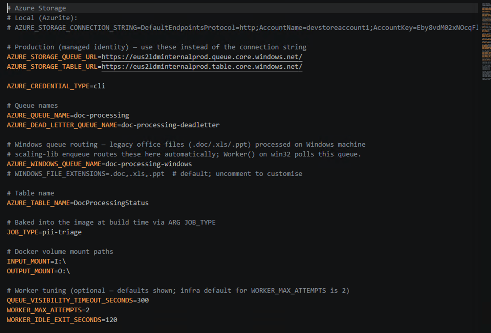
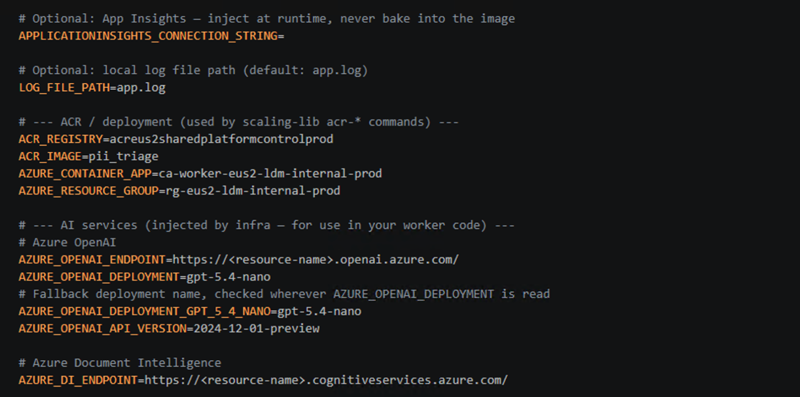

# HWE Scaled — Operations Runbook (Production)

Operator runbook for the **production** deployment of the scaled `pii_triage` pipeline: Docker
workers on Azure Container Apps that pull files off an Azure Storage Queue, run the read-only PII
triage pipeline on each, and write results to a file share. This document covers day-to-day
operations — **first-time setup, deploys, rollbacks, running a job, and incident response**.

For what the pipeline *does* (detection, the two LLM stages, the inventory schema), see
[`README.md`](README.md) and [`pii_triage_merged/README.md`](pii_triage_merged/README.md).

> **Audience & scope.** This runbook documents the live production environment only. All
> resource names, endpoints, and queue names come from your `.env` (see §1.1). The commands are
> the same regardless of environment — what differs is which `.env` and which `az` subscription
> you're pointed at.

> **🖥️ The app does everything after build & deploy.** Building and deploying the worker image
> (§2) is the **only** step that must be run from the command line — the app deliberately doesn't
> touch the control plane. **Everything else — submitting a run, monitoring progress, collecting
> results, reporting, sampling, scoring, and comparing runs — can be done entirely in the HWE
> Scaled app** (`./HWE_Scaled.cmd`). The CLI equivalents throughout §3 are given only for
> reference and automation; day to day, an operator builds/deploys once and then works in the app.

---

## Contents

1. [First-time setup](#1-first-time-setup)
2. [Deploy a new build](#2-deploy-a-new-build)
3. [Run a job (enqueue → monitor → collect)](#3-run-a-job)
4. [Roll back a deployment](#4-roll-back-a-deployment)
5. [Incident response](#5-incident-response)
6. [Command cheat sheet](#6-command-cheat-sheet)

> **📷 Screenshot placeholders.** Figures that don't exist yet are marked like this:
> **`[SCREENSHOT → img/<name>.png]`** with a caption of exactly what to capture. Take the shot,
> save it to `docs/runbook/img/<name>.png`, then replace the placeholder line with
> ``. The two `.env` figures below are already captured.

---

## 1. First-time setup

Do this once per operator machine. It mirrors the original *How to run Scaling HWE* setup, with
verification steps added.

### 1.1 Configure `.env`

Copy the template and fill in the production values:

```bash
cp .env.example .env
```

The full variable reference is in [`README.md`](README.md#environment-variables). The two figures
below show a filled-in production `.env` — the storage/queue/mount block and the AI-services/ACR
block.





Key production values live here (never commit `.env` — it's git-ignored):

| Setting | Production value (from `.env`) |
|---|---|
| `AZURE_CONTAINER_APP` | `ca-worker-eus2-idm-internal-prod` |
| `AZURE_RESOURCE_GROUP` | `rg-eus2-idm-internal-prod` |
| `ACR_REGISTRY` / `ACR_IMAGE` | your prod registry / `pii_triage` |
| `AZURE_QUEUE_NAME` / `AZURE_DEAD_LETTER_QUEUE_NAME` | `doc-processing` / `doc-processing-deadletter` (`AZURE_WINDOWS_QUEUE_NAME` is no longer used — see §3.5) |
| `INPUT_MOUNT` / `OUTPUT_MOUNT` | the mounted Azure File Shares |

### 1.2 Python environment

```powershell
python -m venv ./venv
cd pii_triage_merged
pip install -r requirements.txt
pip install -r requirements-local.txt
cd ..
pip install --force-reinstall "scaling-lib[dev]@git+https://github.com/ldmglobal-com/scaling-lib@dev"
./venv/Scripts/Activate.ps1
```

`requirements-local.txt` pulls in `scaling-lib[dev]` (the `scaling-lib` CLI and `python-dotenv`).
There is no Windows-only pip dependency any more — legacy Office conversion runs via LibreOffice
headless (a system install, not pip; see §3.5), the same on every worker.

### 1.3 Azure login

```powershell
az login
# select the production subscription when prompted (option 3)
```

> **If login fails or hangs:** delete the MSAL caches and retry.
> Go to `C:\Users\<youruser>\.azure`, delete `msal_http_cache.bin` and `msal_token_cache.bin`,
> then run `az login` again.

### 1.4 Verify access

Confirm the CLI can see the queue and status table before doing anything else:

```powershell
scaling-lib status
```

You should see queue depth and per-job counts (empty is fine). If this errors, your `.env`
endpoints or `az login` subscription are wrong — fix that before continuing.

> **`[SCREENSHOT → img/status-empty.png]`** Capture: a clean `scaling-lib status` output on a
> drained queue (0 pending), proving connectivity.

---

## 2. Deploy a new build

A deploy publishes a new worker image and points the Container App at it. The Container App
auto-scales replicas with queue depth — you deploy the image, not individual workers.

**When to build:** any time `worker.py`, `collect_outputs.py`, the `pii_triage` package, or the
`Dockerfile` changes. Each build produces a new image **tagged with the current git SHA**.

**When to skip the build:** re-deploying an image already in ACR (a rollback, or a config-only
change like updated secrets) — use `acr-deploy` with an explicit tag (see §4).

```powershell
# Build + push + deploy in one step (most common)
scaling-lib acr-release
```

Or run the two halves separately when you want to stage before cutting over:

```powershell
scaling-lib acr-build              # build + push the image (tagged with the git SHA)
scaling-lib acr-deploy             # point the Container App at the latest image
```

### Verify the deploy

1. Note the git SHA you just built: `git rev-parse --short HEAD`.
2. Confirm the Container App is serving the new revision (Azure portal → Container App →
   *Revisions*, or `az containerapp revision list -g rg-eus2-idm-internal-prod -n ca-worker-eus2-idm-internal-prod -o table`).
3. Enqueue a **small** test batch (§3) and confirm results land, before running a full corpus.

> **`[SCREENSHOT → img/deploy-revisions.png]`** Capture: the Container App *Revisions* blade
> showing the new revision active with the expected image tag.

> Build & deploy is the hand-off point: once the new image is live, **switch to the app for
> everything below.**

---

## 3. Run a job

**This whole section is done from the app.** Launch it:

```powershell
./HWE_Scaled.cmd        # Windows (double-clickable)   —   or:  ./HWE_Scaled.sh  on macOS/Linux
```

The app binds `127.0.0.1` on a free port and opens a browser (loopback only, read-only over the
corpus, no PII values shown). From here you drive the full run lifecycle without touching the
command line:

| In the app | Does what | CLI equivalent (§ below) |
|---|---|---|
| **New run → submit** | enqueues a corpus under one `job_id` | `enqueue.py` (§3.2) |
| **Monitor** | live queue depth + per-job progress | `scaling-lib status` (§3.3) |
| **Collect** | gathers `result.json` → `inventory.csv` | `collect_outputs.py` (§3.4) |
| **Results / Report / Sample** | Table 1, sample draw, exports | `report` / `sample` (§3.4) |
| **Score / vs-manual-review / Compare** | scoring and run-to-run diff | `score_combined.py` (§3.4) |

> **`[SCREENSHOT → img/app-home.png]`** Capture: the HWE Scaled app landing screen (runs list).

The equivalent CLI steps, for reference or automation, follow. **You don't need to run these if
you're using the app** — it runs them for you and shows the command before it does.

### 3.1 Prepare the corpus

Place each matter under `INPUT_MOUNT` as `<job_dir>/files/` with an optional sibling protocol doc:

```
<job_dir>/
├── files/          ← every file under here is a work item
│   ├── doc1.pdf
│   └── ...
└── protocol.pdf    ← optional; workers pick it up per-matter (.pdf/.docx/.doc/.txt/.rtf)
```

### 3.2 Enqueue

```powershell
python enqueue.py I:\<job_dir>\files
```

Streams the walk (no full listing up front), chunks/parallelizes the submission, and enqueues
everything under one `job_id`. `.doc`/`.xls`/`.ppt` go to the same main queue as everything else
now (§3.5) — `AZURE_WINDOWS_QUEUE_NAME` only still matters if you haven't unset it. To rescan
only the responsive/unresolved subset of a prior run (skips `likely_non_responsive`):

```powershell
python enqueue.py I:\<job_dir>\files --inventory inventory.csv
```

### 3.3 Monitor

```powershell
scaling-lib status
```

Queue depth and per-job completed/pending/failed. Replicas scale up as the queue fills and back
down as it drains.

> **`[SCREENSHOT → img/status-running.png]`** Capture: `scaling-lib status` mid-run showing a
> non-zero queue depth and a job in progress.

### 3.4 Collect and report

Once the queue is **fully drained**:

```powershell
python collect_outputs.py --out inventory.csv
python pii_triage_merged/tools/score_combined.py --inventory inventory.csv ...
```

For non-searchable files, after reviewers fill `gold_responsive`/`gold_bde` in the drawn sample:

```powershell
python -m pii_triage estimate inventory.csv sample.csv --out table2.csv
```

### 3.5 Legacy `.doc`/`.xls`/`.ppt` — no separate Windows leg any more

Legacy Office conversion used to need Win32 COM automation (Windows-only), which meant a
dedicated Windows VM running `python worker.py` natively, a separate `AZURE_WINDOWS_QUEUE_NAME`,
and a two-hop convert-then-forward-to-Linux dance — a real single point of failure sitting
outside the Container Apps fleet's own restart/scale handling (see `SCALED_UI_BUILD_NOTES.md`'s
history for why, if you're curious).

That's gone. `.doc`/`.xls`/`.ppt` now convert to OOXML **inline**, via LibreOffice headless
(`conversion.py`), on whichever Linux worker in the normal fleet happens to dequeue the file —
exactly the same as every other format. There is no Windows VM to run, no
`AZURE_WINDOWS_QUEUE_NAME` to set (leave it unset), and nothing to supervise separately: Container
Apps' own restart-on-crash and scale rule already cover this worker like any other.

The worker image installs `libreoffice-writer`/`-calc`/`-impress` + `antiword` via `apt-get` (see
`Dockerfile`) — nothing to install yourself beyond building/deploying the image normally (§2).

**If you still have a Windows VM worker running from before this change**, drain it (let it
finish converting anything in flight, or let `AZURE_WINDOWS_QUEUE_NAME`'s queue empty) and stop
it — it has nothing left to poll once `AZURE_WINDOWS_QUEUE_NAME` is unset in `.env`.
`run_worker_forever.ps1` / `register_worker_task.ps1` (a supervisor + Scheduled Task registration
for that VM) are kept in the repo only as a rollback path if LibreOffice's conversion fidelity
ever turns out inadequate for some real corpus and the old COM-based `conversion.py` needs
reviving from git history — not part of the normal deploy any more.

---

## 4. Roll back a deployment

A rollback re-points the Container App at a **previous image already in ACR** — no rebuild.

1. **Find the tag to roll back to.** Image tags are git SHAs. Get a recent good one from
   `git log --oneline` or the ACR repository list:

   ```powershell
   az acr repository show-tags -n <ACR_REGISTRY> --repository pii_triage --orderby time_desc -o table
   ```

2. **Deploy that tag** (skips the build entirely):

   ```powershell
   scaling-lib acr-deploy --tag <previous-sha>
   ```

3. **Verify** the active revision now shows the rolled-back tag (§2, *Verify the deploy*), and run
   a small test batch before resuming full traffic.

> **`[SCREENSHOT → img/rollback-tags.png]`** Capture: the `az acr repository show-tags` output
> with the target tag highlighted.

> **Note.** Rollback swaps the worker image only. It does **not** undo results already written to
> the output share, nor drain in-flight messages — those finish on whichever image picked them up.
> For a bad build actively producing wrong output, also **pause enqueuing** and let the queue
> drain before rolling forward again.

---

## 5. Incident response

For each incident: **symptom → diagnose → fix**. Start every investigation with
`scaling-lib status` and the Container App logs (Azure portal → Container App → *Log stream*, or
`az containerapp logs show -g rg-eus2-idm-internal-prod -n ca-worker-eus2-idm-internal-prod --follow`).

> **`[SCREENSHOT → img/incident-logstream.png]`** Capture: the Container App *Log stream* blade —
> the first place to look during any incident.

### 5.1 `az login` / auth failures

- **Symptom:** `scaling-lib` commands or `az` calls fail with auth/credential errors.
- **Diagnose:** confirm you're on the prod subscription (`az account show`).
- **Fix:** delete the MSAL caches (`C:\Users\<youruser>\.azure\msal_http_cache.bin` and
  `msal_token_cache.bin`) and re-run `az login`, selecting the production subscription. Confirm
  `AZURE_CREDENTIAL_TYPE` in `.env` (`cli` for local dev; unset in prod so workers use the managed
  identity).

### 5.2 Rate limiting (`RateLimitError`)

- **Symptom:** result rows show `llm_failed:RateLimitError`; throughput drops.
- **Diagnose:** replica count / concurrent Azure calls exceed your Azure OpenAI deployment's RPM.
  Each worker makes ~1 in-flight LLM call at a time, so total in-flight ≈ replica count.
- **Fix:** the client already retries with backoff, so transient spikes self-heal. For sustained
  throttling, reduce the Container App's max replica count (Azure portal → *Scale*) or raise the
  deployment's RPM quota. Verify the deployment name in `.env`
  (`AZURE_OPENAI_DEPLOYMENT` / `AZURE_OPENAI_DEPLOYMENT_GPT_5_4_NANO`).

### 5.3 Dead-letter queue filling / workers exiting

- **Symptom:** `scaling-lib status` shows a rising dead-letter count; replicas restart.
- **Diagnose:** repeated task failures. Each message retries up to `WORKER_MAX_ATTEMPTS` (default
  2) before dead-lettering. `worker.py` also runs a **DLQ circuit-breaker**: if the dead-letter
  growth rate exceeds `DLQ_FAILURE_RATE` (default `0.05`) after `DLQ_MIN_COMPLETIONS` (default
  `100`), a worker exits itself so the platform recycles it — this is intentional back-pressure,
  not a crash.
- **Fix:** pull a dead-lettered message and read its failure. If it's a bad build → roll back
  (§4). If it's a systemic dependency (Azure OpenAI/DI outage) → pause enqueuing until it clears.
  Tuning knobs (`.env`): `DLQ_FAILURE_RATE`, `DLQ_MIN_COMPLETIONS`, `DLQ_WORKER_COUNT` (set this
  to the fleet size so the failure-rate denominator reflects total throughput).

> **`[SCREENSHOT → img/incident-dlq.png]`** Capture: `scaling-lib status` showing a non-zero
> dead-letter count.

### 5.4 Queue not draining / stuck tasks

- **Symptom:** queue depth flat, no completions, replicas idle or few.
- **Diagnose:** either the Container App isn't scaling (check *Scale* min/max replicas and the
  scale rule), or a worker is wedged on a malformed file — a task's lease expires after
  `QUEUE_VISIBILITY_TIMEOUT_SECONDS` (default 300) and the message is redelivered automatically.
- **Fix:** confirm replicas are scaling with queue depth; bump the max-replica ceiling if the
  queue is deep and replicas are pinned. A single wedged file is bounded by the per-file
  `FILE_TIMEOUT_S` (default 120) and `PII_WATCHDOG_S`; it eventually times out and dead-letters
  rather than blocking the queue.

### 5.5 OCR/LLM producing no enrichment

- **Symptom:** `--ocr`/`--llm` on, but rows show no OCR/LLM activity.
- **Diagnose:** check `USE_OCR` / `USE_LLM` are `true` in the workers' `.env`, and that
  `AZURE_DI_ENDPOINT` / `AZURE_OPENAI_ENDPOINT` are set. A missing `Pillow` silently disables
  embedded-image OCR (see the library README's Pillow warning).
- **Fix:** correct the flags/endpoints and redeploy; the image bundles `Pillow` via
  `requirements.txt`.

### 5.6 Bad deploy

- **Symptom:** results wrong or workers crash-looping right after a deploy.
- **Fix:** **roll back** to the last known-good tag (§4), and pause enqueuing until the queue
  drains so no more work runs on the bad image.

> For `scaling-lib` subcommands beyond those shown here (log/queue/dead-letter helpers), run
> `scaling-lib --help` or see the docs installed with the package (`docs/cli.md`, `docs/status.md`).

---

## 6. Command cheat sheet

Only **log in** and **build/deploy/rollback** are CLI-only. The enqueue / collect / report /
score rows below are what the app runs for you — use them directly only for automation.

| Task | Command |
|---|---|
| Log in | `az login` → select prod subscription |
| Verify connectivity | `scaling-lib status` |
| Build + deploy | `scaling-lib acr-release` |
| Build only | `scaling-lib acr-build` |
| Deploy only (latest) | `scaling-lib acr-deploy` |
| **Roll back** | `scaling-lib acr-deploy --tag <sha>` |
| List image tags | `az acr repository show-tags -n <ACR_REGISTRY> --repository pii_triage --orderby time_desc -o table` |
| Launch the app | `./HWE_Scaled.cmd` (Win) / `./HWE_Scaled.sh` (macOS/Linux) |
| Enqueue a corpus | `python enqueue.py I:\<job_dir>\files` |
| Rescan responsive subset | `python enqueue.py I:\<job_dir>\files --inventory inventory.csv` |
| Collect results | `python collect_outputs.py --out inventory.csv` |
| Container App logs | `az containerapp logs show -g rg-eus2-idm-internal-prod -n ca-worker-eus2-idm-internal-prod --follow` |
| Collect live (before full drain) | `python collect_outputs.py --out inventory.csv --watch` |
